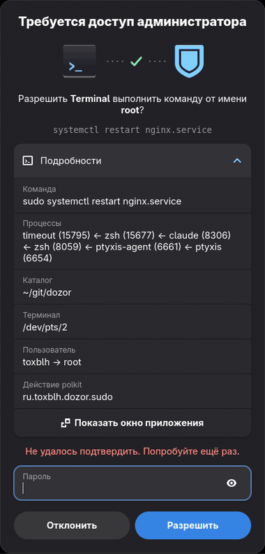
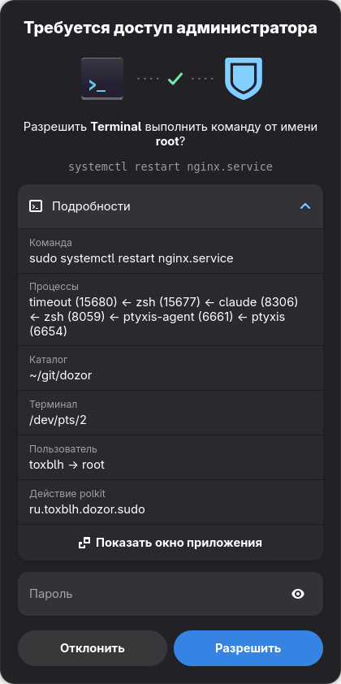
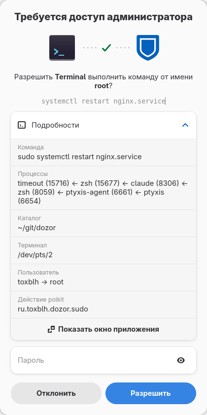
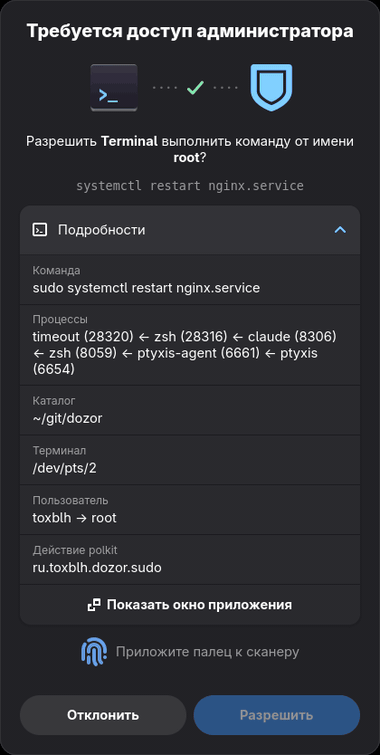
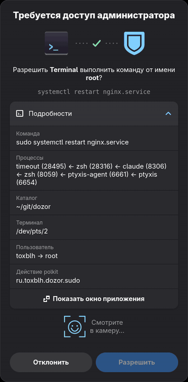
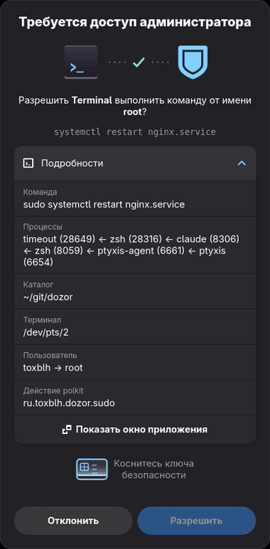

# Dozor

**🇷🇺 [Русская версия](README.ru.md)**

A polkit authentication agent with provenance: it shows **who** is asking for
privileges, **which command** is being run, from which directory and terminal —
with a button that jumps to the requesting application's window. GTK4 +
libadwaita, GNOME styling, dark theme, animations. Handles every polkit
request in the session, plus `sudo` via a PAM hook.

<p align="center">
  
</p>

| Dark | Light |
|------|-------|
|  |  |

Every PAM authentication method gets its own state — detected from the PAM
conversation, icon pulsing while it waits:

| Fingerprint (pam_fprintd) | Face (howdy) | Security key / smartcard (pam_u2f, pam_pkcs11) |
|---------------------------|--------------|-----------------------------------------------|
|  |  |  |

## Features

- **Provenance-first dialog**: requesting app icon, command line, the full
  process ancestry (`sudo ← timeout ← zsh ← claude ← … ← ptyxis`), working
  directory, terminal, user → root, polkit action id — all visible before you
  type anything. The headline names the real actor, skipping wrappers and
  shells: *Allow **claude** from **Terminal** to run a command as root?*
- **Jump to the source**: one click focuses the window of the app that asked.
  Works on any Wayland compositor: **niri**, **Hyprland** and **sway** get
  precise per-pid focus via their IPC (no extension needed there); GNOME goes
  through a tiny Shell extension; `org.freedesktop.Application.Activate` is the
  universal fallback.
- **Every auth method, visualized**: password, fingerprint (pam_fprintd,
  pulsing icon), face (howdy), security key / smartcard with PIN
  (pam_u2f / pam_pkcs11) — detected from PAM conversation messages.
- **Context-aware biometrics**: a PAM gate (`lid-open.sh`) skips the
  fingerprint reader when the laptop lid is closed (docked), and the password
  field stays available *during* the fingerprint wait — start typing, hit
  Enter, and the agent restarts the PAM conversation past the reader
  (one-shot skip flag) and submits your password. Finger or password,
  whichever comes first.
- **GNOME-style motion**: method icon pulses while waiting for biometrics,
  the password field slides in only when PAM actually asks for it, wrong
  password does the Shell-style head shake.
- **sudo integration**: a PAM hook routes sudo auth through polkit, so the
  same dialog (with full command context) appears for terminal sudo. Any
  failure — no agent, ssh session, timeout — falls back to the regular
  terminal password prompt.

## How it works

```
sudo → PAM (pam_exec) → dozor-sudo.sh → pkcheck(ru.toxblh.dozor.sudo)
                              │                    │
                              │ writes context     ▼
                              │ /run/user/UID/  polkitd ── BeginAuthentication
                              ▼ dozor.ctx          │
                                                   ▼
                                        dozor-agent (the Dozor window)
                                                   │ PolkitAgent.Session
                                                   ▼
                                   polkit-agent-helper-1 (setuid) → PAM → ok
```

- `src/dozor.vala` — the agent (Vala, compiled). Implements the
  `org.freedesktop.PolicyKit1.AuthenticationAgent` DBus interface directly
  (`PolkitAgent.Listener` from Python segfaults: pygobject loses the async
  vfunc's `user_data`). Registers for the session in place of GNOME Shell's
  built-in agent and serves **all** polkit requests: polkitd hands the agent
  `polkit.subject-pid`, which resolves to the requesting app (icon, name,
  focus button) for any action.
- `dozor-sudo.sh` — the PAM hook: dumps request context for the window and
  calls `pkcheck`. Context is display-only; authentication is entirely polkit.
- `extension/dozor@toxblh.ru` — GNOME Shell extension: disables the built-in
  agent (`Main.componentManager._disableComponent('polkitAgent')`) and exports
  `ru.toxblh.Dozor.FocusApp` (window activation is allowed from inside Shell).
- `src/collector.vala` — provenance collector. Runs as a **separate process**
  (the agent re-execs itself with `--collect`): one signed artifact, but the
  parsing of attacker-controlled `/proc` data happens where there is no password.
- `src/animation.vala`, `src/focus.vala` — Cairo method animations and
  cross-compositor window focus.
- `dozor.service` — systemd user unit, autostarts the agent (hardened:
  `NoNewPrivileges`, `ProtectSystem=strict`, empty `CapabilityBoundingSet`,
  `SystemCallFilter=@system-service`).

## Install

```sh
./install.sh          # builds with meson, installs to ~/.local/bin
```

Needs `vala`, `meson` and the gtk4 / libadwaita / polkit / json-glib dev
packages. No root for the agent itself — only for the PAM hook and the polkit
action. On GNOME, re-login (Wayland picks up new Shell extensions only at session start).

Fingerprint is expected to be wired in the system PAM stack behind the
`lid-open.sh` gate (see `system-auth-local-only` on ALT):

```
auth  [success=ignore default=1]  pam_exec.so quiet /etc/security/lid-open.sh
auth  sufficient                  pam_fprintd.so
```

## Debugging

```sh
meson compile -C build                       # rebuild after editing src/*.vala
build/dozor-agent --test-pid $$              # agent for this shell only
build/dozor-agent --collect $$ ru.toxblh.dozor.sudo   # provenance collector alone
journalctl --user -u dozor -f                # agent logs
DOZOR_SHOT=/tmp/x.png build/dozor-agent ...  # screenshot a real dialog
```

Known corners: no dialog on the lock screen (lockscreen auth requests are
rare and simply time out); no account chooser — the current user is assumed.

## Contributing / debugging

If you use an AI assistant to debug or fix Dozor, point it at **[LLM.md](LLM.md)** —
it explains the architecture, how to collect a *redacted* diagnostics report
(`./contrib/dozor-report.sh`), and how to file an issue or PR without leaking data.
